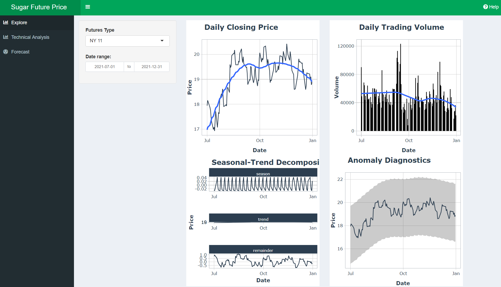

```{r setup, include=FALSE}

knitr::opts_chunk$set(echo = TRUE,
                      eval = TRUE,
                      warning = FALSE,
                      message = FALSE,
                      fig.retina = 3)

```

ShinyApp can be assessed here: https://mjjiang.shinyapps.io/sugar/



Project repository cab be assessed [here](https://github.com/SSM2022/VAProject)


