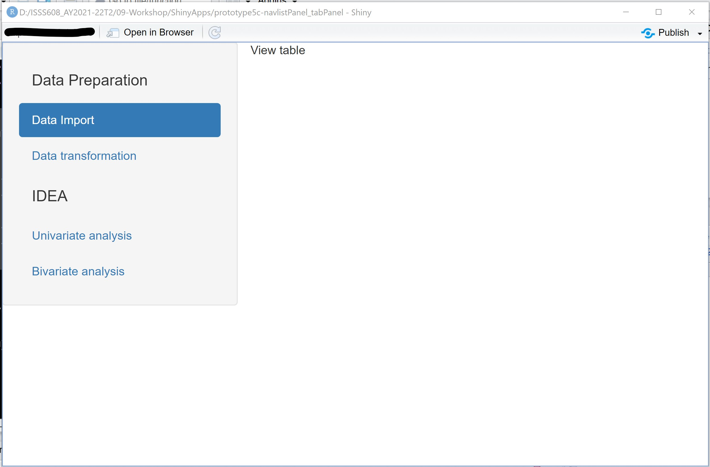
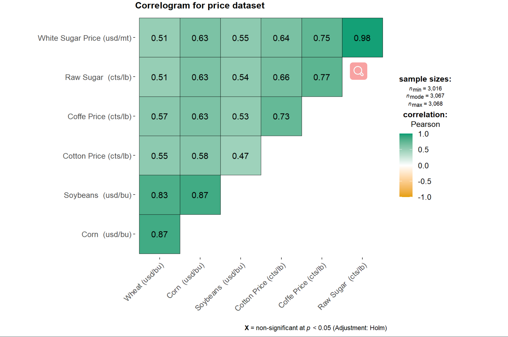
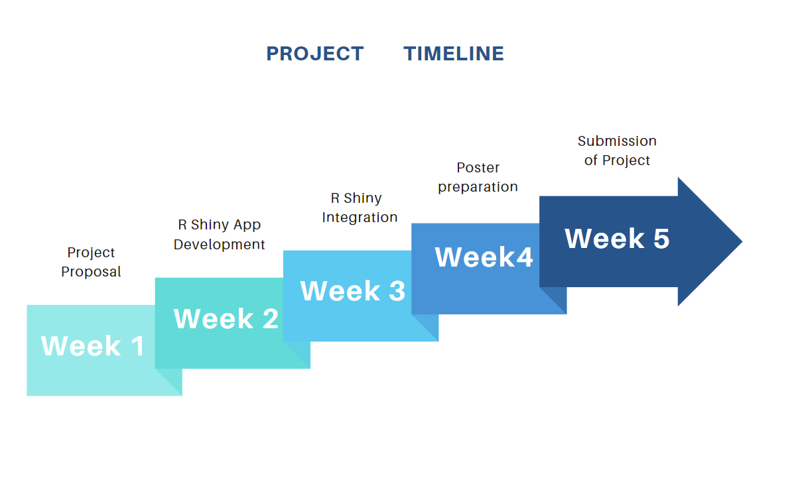

```{r setup, include=FALSE}

knitr::opts_chunk$set(echo = TRUE,
                      eval = TRUE,
                      warning = FALSE,
                      message = FALSE,
                      fig.retina = 3)

```

```{r, echo=FALSE}

packages = c('readxl', 'tidyverse', 'ggHoriPlot', 'ggTimeSeries', 'kableExtra', 'ggthemes', 'corrgram', 'ggstatsplot', 'plotly')

for(p in packages){library
  if(!require(p, character.only = T)){
    install.packages(p)
  }
  library(p, character.only = T)
}
```

```{r, echo=FALSE}

psd <- read_csv("data/psd_sugar.csv")

Price <- read_xlsx("data/Prices.xlsx")

GDP <- read_xlsx("data/GDP.xlsx")

Pop <- read_xlsx("data/Population.xlsx")

```

# 1. Background 

International sugar prices are in general volatile, which are not only impacted by fundamental supply and demand, but also driven by the macro environment. Supply and demand of sugar refers to the production and consumption of sugar. There are two types of sugar production source, sugar beet and cane. Consumption of sugar consists of human consumption and industrial usage for animal feed, methionine and so on. Marco environment refers to the economic factors, demographic forces, technological factors, natural and physical forces, political and legal forces, and social and cultural forces. 

 

# 2. Project Motivation 

A detailed study of global sugar supply and demand will help government to strategize country stock as sugar is one of the food staple. The sugar price forecast will provide insights to investors for better profit. This study aims to examine both the fundamental and macro factors to advise policy makers and general investors. 

***Fundamental factors to be explored:*** 

  

- global sugar production and consumption   

- global sugar tradeflow: import and export  

- stock and stock-to-use ratio 

  

***Macro factors to be explored: *** 

 - Agricultural basket price  

- GDP growth rate   

- population growth rate 

- energy prices   

- currency: USD to Brazil real exchange rate  

Our final deliverable is to create a user-friendly, interactive dashboard that allows individuals and countries to view fundamental data, evolution with time, seasonality pattern, price correlation. Lastly, we will build a preliminary model to forecast sugar prices. 

 

Our final deliverable is to create a user-friendly, interactive dashboard that allows individuals and countries to view fundamental data, evolution with time, seasonality pattern, price correlation. Lastly, we will build a preliminary model to forecast sugar prices. 

# 3. Data Description 

Our datasets for analyses come from the [Intercontinental Exchange® (ICE)](https://www.theice.com/marketdata/reports/FuturesUSReportCenter.shtml?productName=Sugar), [Nasdaq Stock Exchange](https://www.nasdaq.com/market-activity/commodities/eh/historical), the [United States Department of Agriculture (USDA)](https://apps.fas.usda.gov/psdonline/app/index.html#/app/downloads) and [International Monetary Fund(IMF)](https://www.imf.org/en/Publications/WEO/weo-database/2021/October/select-country-group).   

- USDA shares historical sugar production, consumption, import, export, beginning stock and ending stock data for all the countries globally. The data from 1972 to 2021 has been downloaded into *psd_sugar.csv*. 

- ICE and Nasdaq contain historical data on NY No.11 raws sugar, LDN 5 white sugar, brent, ethanol, corn, soybean, wheat, coffee, cotton price and USD/BRL exchange rate. All the data from 2010 to 2021 has been compiled into a excel file *Price.xlsx* 

- IMF provides data on the world economic factors. Gross Domestic Product (Nominal, Domestic Currency) for all the countries from 2009 to 2020 has been downloaded into *GDP.xlsx*. Global population per country has been downloaded into * Population.xlsx*. 
 

# 4. Proposed Visualizations 

We aim to use our visualization to provide users multiple perspectives to understand the global sugar market in a direct and interactive way, which is one major advantage of visualization. To structure multiple perspectives in our ShinyApp, we will use [navlistPanel()](htps://shiny.rstudio.com/reference/shiny/1.7.0/navlistPanel.html) to show different building blocks vertically in a sidebar. Below demonstrates how the vertical layout looks like: 

 

Our ShinyApp will contain 3 building blocks: global sugar supply and demand, sugar price correlation with other commodities, and time series forecast of sugar price. 

##  Fundamentals

The first thing we want to present about global sugar market is the supply demand relation to give audience and users a general picture about the market. 

###   Global production VS consumption balance map with the selected year 

###  Animated histogram graph of global sugar production and consumption change over time 


##   Prices 

We are also trying to analyze and present the among sugar price, other agricultural commodities prices, and oil prices. 

### Correlation matrix of agricultural commodities prices  


We try to compare the price of sugar and different commodities, such as raw sugar, white sugar price, wheat, corn and soybeans. Then we can find out the relation between sugar with other staple commodities if they are highly correlated or not. 

 

## Sugar price VS oil and ethanol Price  

 

### Scatterplot of sugar and brent price 

Sucrose from sugarcane can be used to produce either sugar or ethanol. Ethanol is in the energy complex. Therefore, we are also interested in how sugar price reacts with oil and ethanol price.  

##  Time Series Forecast
Next, we would like to examine the price evolution over time to understand the general trend and outliers. Both horizon plot and calendar heatmap could present time series data. We choose horizon plot for easy comparison of sugar price and other commodities price.

###   Horizon plot of agricultural commodities prices and brent

```{r, fig.height= 8, fig.width = 10, echo=FALSE}

```

 

###    Time series modelling of sugar price  


# 5. Project Timeline 

 The following is the proposed project timeline: 

 

 

# 6. Software Tools & R Packages 

 

Our project will be done as an R Shiny application using RStudio as the IDE. We envision the use of the following packages: 

 

-   R Shiny -- For creating an interactive R Shiny web-based application 

-   Tidyverse -- The tidyverse collection of apps will provide the foundational packages for our project. Some core uses of this collection will be for plotting (ggplot2), data cleaning and manipulation (dplyr, tidyr). 

-   ggstatsplot -- using ggcorrmat() in the package of over many other methods to visualise a correlation matrix is its ability to provide a comprehensive and yet professional statistical report as shown in the figure below. 

 

 

# 7. Github Repository 

The artifacts of our project can be found at [Github](https://github.com/gsfamy/VA/tree/master/Group%20Project/Visual%20Project-G6) 

# 8. References 

[Forecasting International Sugar Prices: A Bayesian Model Average Analysis](https://link.springer.com/content/pdf/10.1007/s12355-020-00815-0.pdf) 

 