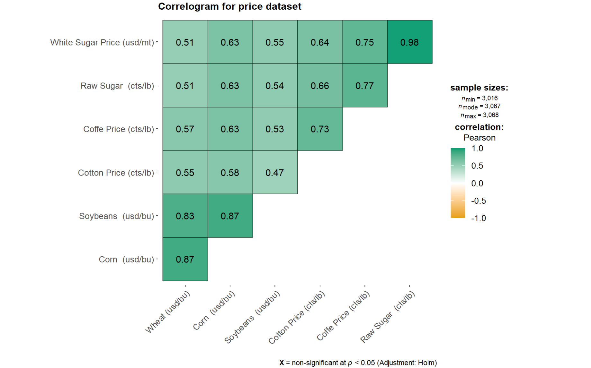

```{r setup, include=FALSE}

knitr::opts_chunk$set(echo = TRUE,
                      eval = TRUE,
                      warning = FALSE,
                      message = FALSE,
                      fig.retina = 3)

```

```{r, echo=FALSE}

packages = c('readxl', 'tidyverse', 'ggHoriPlot', 'ggTimeSeries', 'kableExtra', 'ggthemes', 'corrgram', 'ggstatsplot', 'plotly')

for(p in packages){library
  if(!require(p, character.only = T)){
    install.packages(p)
  }
  library(p, character.only = T)
}
```

```{r, echo=FALSE}

psd <- read_csv("data/psd_sugar.csv")

Price <- read_xlsx("data/Prices.xlsx")

GDP <- read_xlsx("data/GDP.xlsx")

Pop <- read_xlsx("data/Population.xlsx")

```

# 1. Background 

International sugar prices are in general volatile, which are not only impacted by fundamental supply and demand, but also driven by the macro environment. Supply and demand of sugar refers to the production and consumption of sugar. There are two types of sugar production source, sugar beet and cane. Consumption of sugar consists of human consumption and industrial usage for animal feed, methionine and so on. Marco environment refers to the economic factors, demographic forces, technological factors, natural and physical forces, political and legal forces, and social and cultural forces. 

# 2. Project Motivation 

A detailed study of global sugar supply and demand will help government to strategize country stock as sugar is one of the food staple. The sugar price forecast will provide insights to investors for better profit. This study aims to examine both the fundamental and macro factors to advise policy makers and general investors. 

Our final deliverable is to create a user-friendly, interactive dashboard that allows individuals and countries to view fundamental data, evolution with time, seasonality pattern, price correlation. Lastly, we will build a preliminary model to forecast sugar prices. 

# 3. Data Description 

Our datasets for analyses come from the [Intercontinental Exchange® (ICE)](https://www.theice.com/marketdata/reports/FuturesUSReportCenter.shtml?productName=Sugar), [Nasdaq Stock Exchange](https://www.nasdaq.com/market-activity/commodities/eh/historical), the [United States Department of Agriculture (USDA)](https://apps.fas.usda.gov/psdonline/app/index.html#/app/downloads) and [International Monetary Fund(IMF)](https://www.imf.org/en/Publications/WEO/weo-database/2021/October/select-country-group).   

- USDA shares historical sugar production, consumption, import, export, beginning stock and ending stock data for all the countries globally. The data from 1972 to 2021 has been downloaded into *psd_sugar.csv*. 
- ICE and Nasdaq contain historical data on NY No.11 raws sugar, LDN 5 white sugar, brent, ethanol, corn, soybean, wheat, coffee, cotton price and USD/BRL exchange rate. All the data from 2010 to 2021 has been compiled into a excel file *Price.xlsx*
- IMF provides data on the world economic factors. Gross Domestic Product (Nominal, Domestic Currency) for all the countries from 2009 to 2020 has been downloaded into *GDP.xlsx*. Global population per country has been downloaded into * Population.xlsx*. 
 

# 4. Proposed Visualizations 

We aim to use our visualization to provide users multiple perspectives to understand the global sugar market in a direct and interactive way, which is one major advantage of visualization. To structure multiple perspectives in our ShinyApp, we will use [navlistPanel()](htps://shiny.rstudio.com/reference/shiny/1.7.0/navlistPanel.html) to show different building blocks vertically in a sidebar. Below demonstrates how the vertical layout looks like: 

 

Our ShinyApp will contain 3 sub-modules: global sugar supply and demand fundamentals, sugar price exploration and correlation with other commodities, and lastly forecast of sugar price. 

## 4.1 Fundamentals

The first thing we want to present about global sugar market is the supply demand relation to give audience and users a general picture about the market. 

###   Global production VS consumption balance map with the selected year 

 

 
###    Pie Chart for sugar attribute of a selected country  

 

 
###  Animated histogram graph of global sugar production and consumption change over time 

 

##  4.2 Prices 

### Technical analysis 

We are trying to anlyse the price fluctuation from 2010-2021, so the line chart and candlestick chart will be used to find out the time pattern of sugar price. Furthermore, it could be basic chart for closing price or closing volume, and it also could be moving average and so on. It rough designed sketch as follows.	 

 

### Bivariate analysis 

We are also trying to analyze and present the among sugar price, other agricultural commodities prices, and oil prices. 

+ Correlation matrix of agricultural commodities prices  

We try to compare the price of sugar and different commodities, such as raw sugar, white sugar price, wheat, corn and soybeans. Then we can find out the relation between sugar with other staple commodities if they are highly correlated or not. 

 

+ Correlation matrix of sugar, oil and ethanol Price  

Except for agricultural commodities prices, the sugar price also fluctuates with the price of oil and ethanol. Therefore, we want to explore their correaltion separately. 

 

Sucrose from sugarcane can be used to produce either sugar or ethanol. Ethanol is in the energy complex. Therefore, we are also interested in how sugar price reacts with oil and ethanol price.  

+ Scatterplot of sugar and brent price 

 

+ Scatterplot of sugar and ethanol price 

 


## 4.3 Forecast

Numerous studies have been conducted to forecast sugar prices. Below are the key determinants of sugar price dynamics. 

**World sugar production and consumption surplus/deficit:** reflects the supply and demand balance.

**Stock-to-use ratio:** indicates how tight the market is in terms of relative stock level to consumption level.

**Brazil cost of production:** The global sugar market is dominated by Brazil, the world’s largest sugar producer and exporter.It means that supply shocks in that country have significant impacts on international
sugar prices and trade flows. It also implies that world sugar prices tend to follow the changes in marginal cost of production in Brazil.

**Energy prices:** Sugarcane and sugar beet can also be used to produce ethanol. Brazil producers have the flexibility to switch between sugar and ethanol production, following the price difference movement between sugar and ethanol. When ethanol price is high, more sucrose will be diverted into ethanol production, which will tighten the sugar supply and subsequently impact sugar price.

**GDP growth rate:** mainly has an impact on demand and investment decisions.  

**Population growth rate:** mainly impacts consumption growth rate.

**USD/Brazil exchange rate:** World market sugar price trades in USD. A depreciation of Brazil real currency means cheaper Brazil cost of production in USD denomination. 

We want to build multiple models, compare and select the best one so that users can use the best model to forecast suagr price. Users can input values for these variables and after that forecasted results will be shown. 

The stretch of this sub-module is as shown below.


# 5. Project Timeline 

 The following is the proposed project timeline: 

 

 

# 6. Software Tools & R Packages 

 
Our project will be done as an R Shiny application using RStudio as the IDE. We envision the use of the following packages: 

- R Shiny -- For creating an interactive R Shiny web-based application 

- Tidyverse -- The tidyverse collection of apps will provide the foundational packages for our project. Some core uses of this collection will be for plotting (ggplot2), data cleaning and manipulation (dplyr, tidyr). 

- ggstatsplot -- using ggcorrmat() in the package of over many other methods to visualise a correlation matrix is its ability to provide a comprehensive and yet professional statistical report as shown in the figure below. 


- R Shiny -- For creating an interactive R Shiny web-based application 

- Tidyverse -- The tidyverse collection of apps will provide the foundational packages for our project. Some core uses of this collection will be for plotting (ggplot2), data cleaning and manipulation (dplyr, tidyr). 

- ggstatsplot -- using ggcorrmat() in the package of over many other methods to visualise a correlation matrix is its ability to provide a comprehensive and yet professional statistical report as shown in the figure below. 

- tidyquant --  bringing financial and business analysis to the tidyverse. 

- plotly -- creating interactive web graphics from 'ggplot2' graphs and/or a custom interface to the (MITlicensed) JavaScript library 'plotly.js' inspired by the grammar of graphics. 

- tmap,sf  -- standardizing the geological coordinates to plot and creat geospaitial heatmap to show how much each coutry would export and import sugar. 

-  readxl – importing data in the xls form 

- [lubridate](https://lubridate.tidyverse.org/) package -- to deal with date-times.

- [modeltime](https://business-science.github.io/modeltime/) -- to do Time series forecast with tidymodels.

- [tidymodels](https://www.tidymodels.org/) -- a collection of packages for modeling and machine learning using tidyverse principles.

- [tidyquant](https://business-science.github.io/tidyquant/) -- integrates the best resources for collecting and analyzing financial data.  

- [glmnet](https://glmnet.stanford.edu/articles/glmnet.html) -- a package that fits generalized linear and similar models via penalized maximum likelihood. 

- [randomForest](https://www.rdocumentation.org/packages/randomForest/versions/4.7-1/topics/randomForest) -- implements Breiman's random forest algorithm (based on Breiman and Cutler's original Fortran code) for classification and regression.

- [earth](https://www.rdocumentation.org/packages/earth/versions/5.3.1/topics/earth) -- to build a regression model using the techniques in Friedman's papers "Multivariate Adaptive Regression Splines" and "Fast MARS".

- [caret](https://topepo.github.io/caret/) package (short for Classification And REgression Training) -- a set of functions that attempt to streamline the process for creating predictive models. The package contains tools for data splitting, pre-processing, feature selection, model tuning using resampling, variable importance estimation


# 7. Github Repository 

The artifacts of our project can be found at [Github](https://github.com/SSM2022/VAProject) 

# 8. References 

[Forecasting International Sugar Prices: A Bayesian Model Average Analysis](https://link.springer.com/content/pdf/10.1007/s12355-020-00815-0.pdf) 
[Your First Machine Learning Project in R Step-By-Step](https://machinelearningmastery.com/machine-learning-in-r-step-by-step/)

 