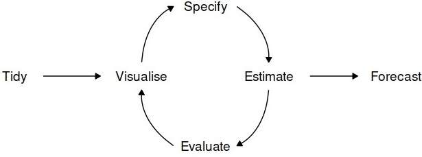

 
<style>
#main-img-left, #main-img-center, #main-img-right {
width: 20%;
}
</style>
 
```{r echo=FALSE, eval=FALSE}
library(pagedown)
pagedown::chrome_print("VAAposter.html")
```
 
```{r setup, include=FALSE}
knitr::opts_chunk$set(echo = FALSE)
```
 
# Motivation 
Comparing the performance of different futures of common commodities such as sugar is not very familiar with normal investors, especially if you want to do it repeatedly. With the help of R, Shiny and the availability of many open-source R packages, we developed a Sugar Future Analyzer- to do technical analysis and forecasting to help those investors to do better investment decisions.     

# Approach and Design Framework
Our project will explore and develop an app to analyze 
all sugar futures on the current market.
 
`Exploration`: Exploratory Data Analysis explores the trends
of sugar future prices and transaction volumes using TIME SERIES
analysis. We select all kinds of futures and
compare them within the same selected time period.
 
`Technical Analysis`: Many investors analyze futures based on their fundamentals such as supply and demand but fundamental factors aren't always reflected in the market price. Technical analysis using charts
help to identify trading signals and price patterns and provides as a window into market psychology to identify opportunities to profit. We built this with the core functions from TidyQuant[Ref.1] and timetk[Ref.2] to support.
1.	Manipulating Financial Data  
2.	Performance Analysis   
 
`Forecasting` : As a final feature, we build a forecasting flow for a future incorporating a dashboard to train several ML models and the associated visualization and performance matrix of the trained models, as well as the forecasts comparison for the future. 
 
```{r, echo=FALSE, out.width="80%", fig.align="center", fig.cap = "Forecast process"}

```
 
 
 
# Key Output and Features
 
`EDA For Sugar Futures`

Exploratory Data Analysis implements a view of 4 equal sections, each showing a different type of chart. 
Daily Closing Price visualizes the daily closing price. Zooming into the period from July 2021 to December 2021, we can see that NY 11 daily closing price is volatile, ranging between 17cts/lb to 20.5 cts/lb.  Daily Trading Volume visualizes the daily trading volume. Peak daily trading volume happened in the first half of September 2021. Massive selling orders pushed NY 11 price lower by more than 0.5cts/lb in 2 weeks. Seasonal-Trend Decomposition visualizes the seasonality, trend, and remainders composition of the price. Seasonal composition shows that there is a periodical behavior for around 7 days. The general trend of NY 11 sugar price from July 2021 is increasing until earlier September 2021 and decreasing afterwards till the end of 2021. Anomaly Diagnostics visualizes anomalies in the time series data. No anomalies are observed for the selected period from July to December 2021.
  

```{r, echo=FALSE, out.width="100%", fig.align="center", fig.cap = "EDA Visualisation"}
knitr::include_graphics("data/eda.png")
```
 
`Technical Analysis for a Sugar Futures` 
 
1. Price Movement Candlestick Chart    

Candlestick charts shows the open, close, high and low) price. The color of the central body tells investors whether the opening or closing price was higher. A green body means a higher closing price than the opening price, indicating buying pressure. The top and bottom of the stick shows the high and the low of the day. Hammer patterns appeared in NY 11 sugar price in March 2022, indicating the bottom of a downtrend. Three-white-soldiers pattern appeared in December 2022,  showing a steady buying pressure. Investors need to be cautious of short sellers when this pattern appears to be too long. 

```{r, echo=FALSE, out.width="100%", fig.align="center", fig.cap = "Sample Visualisation for Single Stock"}


```

2. Moving averages (15-day, 50-day) Chart

Moving average price smooths out the price trends by filtering out the noise from the random short-term price fluctuations.  This study visualized 4 types of moving average price, namely simple moving average(SMA), exponential moving average(EMA), double exponential moving average(DEMA) and elastic volume-weighted moving average(EVWMA). When sugar price crosses over the moving average line, it signals of potential change in trend.
 
```{r, echo=FALSE, out.width="100%", fig.align="center", fig.cap = "Sample Visualisation for Single Stock"}

```

3. Bollinger Bands

Bollinger bands are used to measure the highness and lowness of the price, relative to previous trades. The closer the prices move to the upper band, the more overbought the market, and a trend reversal is more likely to happen, vice versa.


```{r, echo=FALSE, out.width="100%", fig.align="center", fig.cap = "Sample Visualisation for Single Stock"}
knitr::include_graphics("data/Bollingor.png")
```

`Forecasting in 4 different models (Arima/Exponential Smooting/Prophet/Lasso )`   

```{r, echo=FALSE, out.width="100%", fig.align="center", fig.cap = "Sample Visualization of Forecast Model Outcomes"}
knitr::include_graphics("data/forecast1.png")
```

The prophet model is the best model based on our default selection with the highest accuracy of MAE(mean absolute error)
```{r, echo=FALSE, out.width="100%", fig.align="center", fig.cap = "Sample Visulisation Model Performance"}
knitr::include_graphics("data/forecast2.png")
```
 
# Learnings and Future Work

R shiny can democratize data and analytics through web-based analytical applications for data exploration, visualization analysis and modelling. And it is convenient and reusable at different time.

Other commodities (e.g., oil) can be used to do the same analysis as sugar futures.In the future, an interactive interface allowing users to select other commodity futures might be introduced to this program. In addition, other package (e.g., Quandl) can also be explored for those commodities.
 
# Conclusion
 
In conclusion, we can provide to the investor a simple interface to do sugar future review and analysis to make better investment decisions using those useful R packages that specialize in time series analysis and technical functions for Financial Analysis and Shiny.
 
# References
1.TidyQuant Project Website: https://business-science.github.io/tidyquant/  
2.Time series analysis in the tidyverse: https://business-science.github.io/timetk/               
3.Modeltime forecast  future data:  https://business-science.github.io/modeltime/reference/modeltime_forecast.html
4. 7 Technical Indicators to build a trading toolkit: https://www.investopedia.com/top-7-technical-analysis-tools-4773275
 


