```{r setup, include=FALSE} 

knitr::opts_chunk$set(echo = TRUE) 

``` 

# Explore 


## 1. Use this Explore button to do exploratory data analysis: 

1)  User to select the futures type to find a specific sugar future. 

2)  User to select the date range to get the information of specific date range 


```{r, echo=FALSE, out.width="100%", fig.align="center"} 

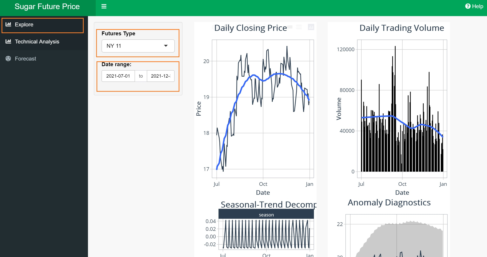 

``` 

3) User can mouse over to look the price of the particular dot. 


```{r, echo=FALSE, out.width="100%", fig.align="center"} 

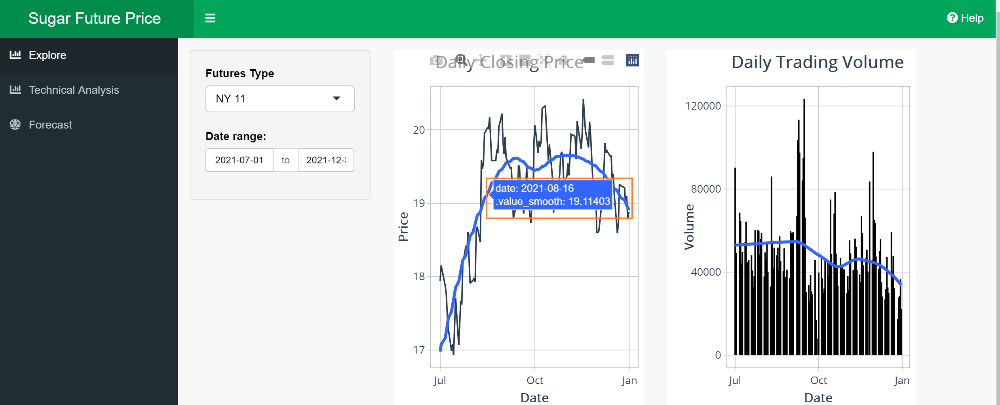 

``` 

4) User can select the particular part to zoom in the visulisation. 

```{r, echo=FALSE, out.width="100%", fig.align="center"} 

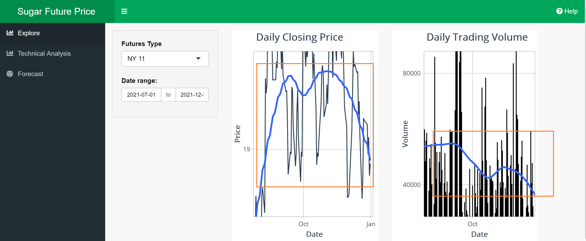 

``` 

# Technical Analysis 

Except those steps which are same as the explore part, it adds the chart type button for users to choose. Users can follow the steps below: 


## 1. Click the Technical Analysis button to do technical analysis: 


```{r, echo=FALSE, out.width="100%", fig.align="center"} 

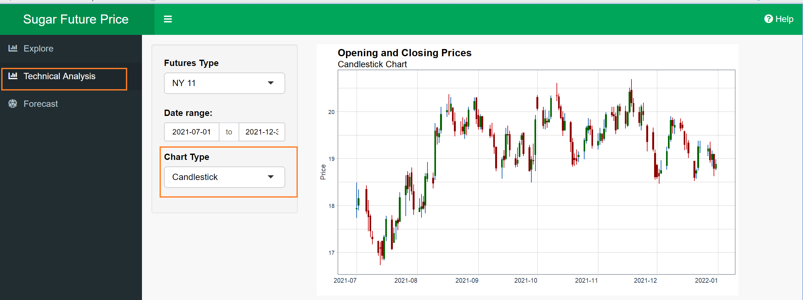 

``` 


## 2. Select the type of chart you want to view by clicking the drop-down menu. The available options are: 

+ Candlestick Chart-which will show the daily opening and closing prices for the future

i.Red Bar means the stock closed lower, then when it opened 
ii.Green Bar means the stock closed higher, then when it opened 

```{r, echo=FALSE, out.width="100%", fig.align="center"} 

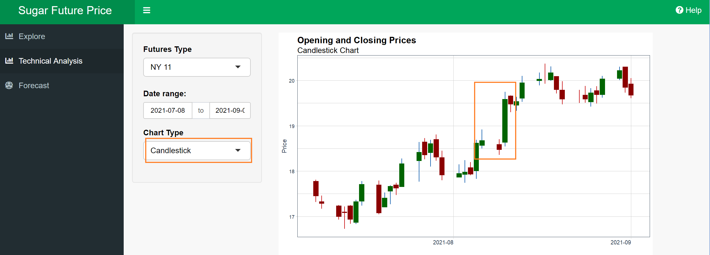 

``` 

+ Averages-Simple Moving Average (20 day and 50 day), overlay-ed with the candlestick chart

```{r, echo=FALSE, out.width="100%", fig.align="center"} 

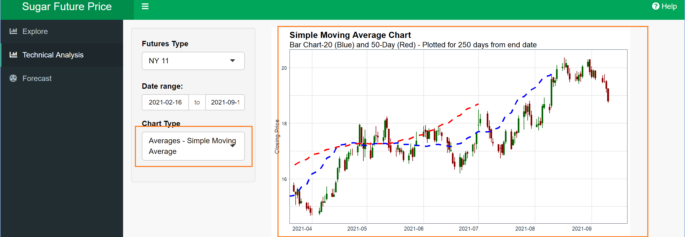 

``` 
+ Averages-Exponential Moving Average ( 20 day and 50 day ), overlay-ed with the candlestick chart 

```{r, echo=FALSE, out.width="100%", fig.align="center"} 

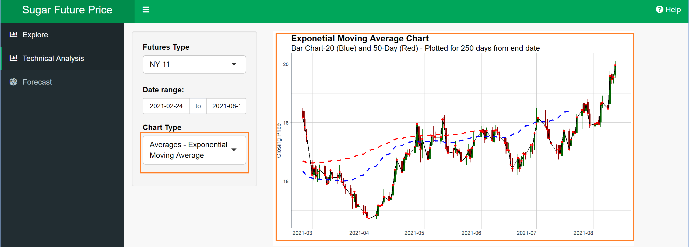 

``` 
+ Averages-Double Expoential Moving Average (20 day and 50 day), overlayed with the candlestick chart 

```{r, echo=FALSE, out.width="100%", fig.align="center"} 

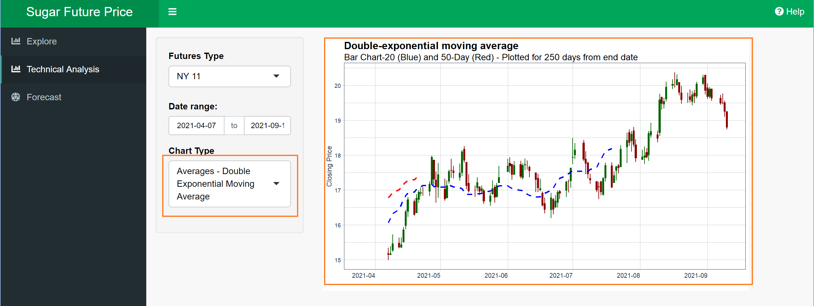 

``` 
+ Averages-Elastic Volume-Weighted Moving Average (20 day and 50 day), overlayed with the candlestick chart 

```{r, echo=FALSE, out.width="100%", fig.align="center"} 

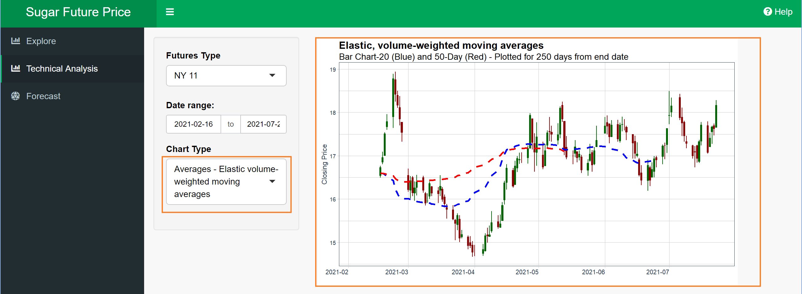 

``` 
+ Simple Moving Average with Bollinger Bands 

```{r, echo=FALSE, out.width="100%", fig.align="center"} 

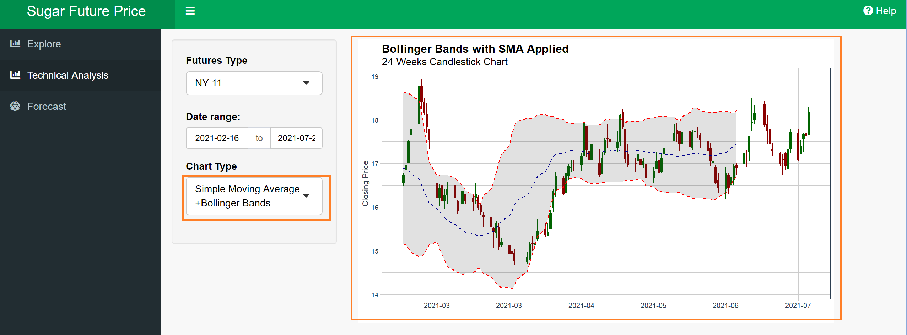 

``` 

   As the actual mathematical and technical definition of the averages are beyond of the scope of this user guide, please visit this link to understand what they mean before analyzing the chart: [Plot moving averages](https://business-science.github.io/tidyquant/reference/geom_ma.html) 


# Forecast

Use this Forecast button to do time series forecasting analysis with four machine learning methods.
+ choose the futures type, date range and which percent of data the users want to split for training the forecast model as below

```{r, echo=FALSE, out.width="100%", fig.align="center"} 

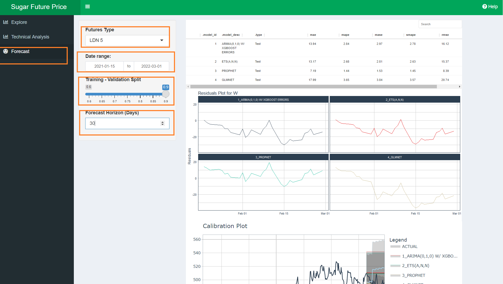 

``` 

# General usage

At the right of the name of shiny app, there is an icon to hide the three main parts names if the users don not want to see. And at the top right of the green bar is a button for users guide to seek help. 

```{r, echo=FALSE, out.width="100%", fig.align="center"} 

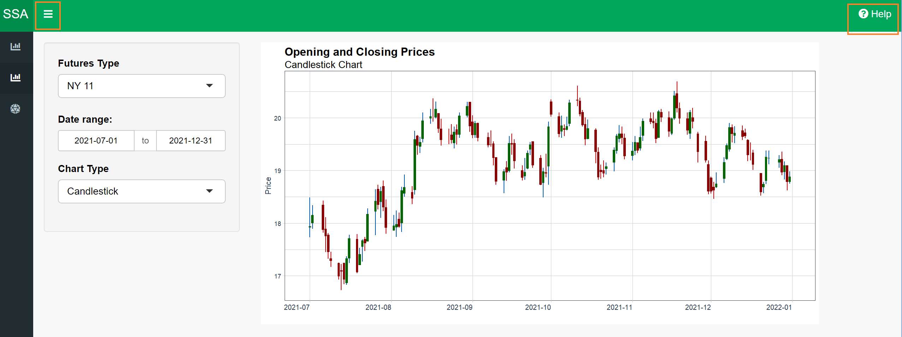 

``` 

 


